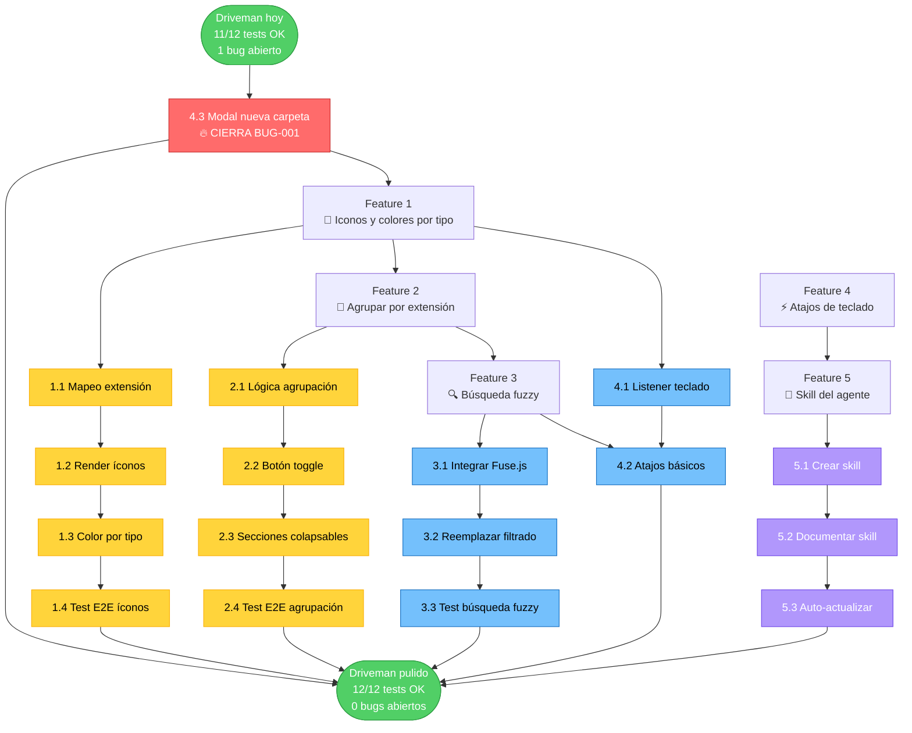
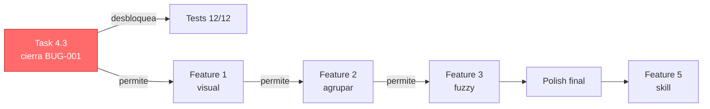

# Driveman Desktop — Roadmap de features

Este documento lista las features priorizadas, cada una con sus tasks. Un agente (humano o IA) puede ir tomando tasks una por una y marcándolas como completadas.

## Convenciones

- Cada task tiene un **criterio de aceptación** verificable.
- Cada task tiene un **comando de verificación** que el subagente test corre.
- Después de cada task, **siempre** se corre el subagente test (ver sección "Loop de testing" al final).
- Si una task rompe tests existentes, NO se marca como completada hasta que la suite vuelva a verde.
- Los archivos comunes a tocar son:
  - `public/index.html` — estructura visual.
  - `public/styles.css` — estilos y themes.
  - `public/app.js` — lógica de UI.
  - `electron/main.cjs` — IPC handlers si hace falta nueva operación de filesystem.
  - `tests/e2e/` — tests nuevos para la feature.

---

## Feature 1: Iconos y colores por tipo de archivo

**Problema:** el explorador actual muestra solo el nombre del archivo en texto plano. En un mar de 49+ carpetas, el ojo se pierde.

**Objetivo:** que cada archivo tenga un ícono y un color según su extensión, de un vistazo.

### Task 1.1 — Mapeo extensión → tipo semántico

**Descripción:** Crear un mapa `extension -> tipo` en `public/app.js` (ej: `.pdf` -> `doc`, `.xlsx` -> `sheet`, `.png` -> `image`, `.js` -> `code`). Sin librerías externas.

**Criterio de aceptación:** existe un objeto `EXTENSION_TYPE_MAP` con al menos 10 extensiones cubiertas.

**Archivos:** `public/app.js`.

**Verificación:** `npm run agent:run` (debe pasar sin regresiones).

### Task 1.2 — Render de íconos por tipo

**Descripción:** agregar una columna o ícono a la izquierda del nombre que muestre el tipo semántico (usando glifos Unicode o un sprite simple). Las carpetas siguen mostrando su ícono actual.

**Criterio de aceptación:** cada fila tiene un ícono distinto para `doc`, `sheet`, `image`, `code`, `archive`, `audio`, `video`, `other`.

**Archivos:** `public/index.html`, `public/styles.css`, `public/app.js`.

**Verificación:** abrir la app, ver íconos distintos.

### Task 1.3 — Color de fila por tipo

**Descripción:** aplicar un color de fondo sutil o un borde izquierdo coloreado según el tipo. Las carpetas mantienen el color actual.

**Criterio de aceptación:** las filas de archivo tienen un acento de color distinto por tipo, configurable via CSS variables.

**Archivos:** `public/styles.css`.

**Verificación:** visual.

### Task 1.4 — Test E2E de iconos por tipo

**Descripción:** agregar test que verifique que filas de archivos con distintas extensiones tienen clases CSS distintas en el DOM.

**Criterio de aceptación:** nuevo spec `tests/e2e/visual.spec.cjs` con al menos 2 tests pasando.

**Archivos:** `tests/e2e/visual.spec.cjs`, `tests/helpers/`.

**Verificación:** `npm run agent:run` con 13+ tests pasando.

---

## Feature 2: Agrupar por extensión

**Problema:** cuando tenés 49 elementos, encontrar todos los PDFs requiere scroll manual.

**Objetivo:** un botón que agrupa la lista por extensión, mostrando secciones colapsables.

### Task 2.1 — Lógica de agrupación

**Descripción:** función `groupBy(items, key)` que devuelve un objeto `Map<extension, items[]>`. Sin librerías.

**Criterio de aceptación:** la función existe y maneja el caso de carpetas (sin extensión) agrupándolas bajo `(carpetas)`.

**Archivos:** `public/app.js`.

**Verificación:** unit test mental (revisar código).

### Task 2.2 — Botón toggle "Agrupar"

**Descripción:** botón en la toolbar `#btn-group-by` que alterna entre vista plana y agrupada.

**Criterio de aceptación:** el botón cambia de estado visual (activo/inactivo) y la lista se re-renderiza.

**Archivos:** `public/index.html`, `public/app.js`, `public/styles.css`.

**Verificación:** visual.

### Task 2.3 — Render de secciones colapsables

**Descripción:** cuando está agrupado, cada extensión es un header clickeable que colapsa/expande sus items.

**Criterio de aceptación:** click en un header oculta/muestra los items de esa extensión, con animación suave.

**Archivos:** `public/app.js`, `public/styles.css`.

**Verificación:** visual.

### Task 2.4 — Test E2E de agrupación

**Descripción:** test que activa el modo agrupado y verifica que aparecen headers por extensión.

**Criterio de aceptación:** nuevo test en `flows.spec.cjs` que pase.

**Archivos:** `tests/e2e/flows.spec.cjs`.

**Verificación:** `npm run agent:run`.

---

## Feature 3: Búsqueda fuzzy

**Problema:** la búsqueda actual es substring exacto. `gasreact` no encuentra `GAS REACT CRUD`.

**Objetivo:** búsqueda tolerante a typos y mayúsculas.

### Task 3.1 — Integrar Fuse.js

**Descripción:** agregar Fuse.js como única dependencia externa del proyecto (decisión consciente que rompe la regla "sin libs de terceros en runtime", pero justificada).

**Criterio de aceptación:** Fuse.js está en `package.json` como dependencia de producción, cargado en `index.html`.

**Archivos:** `package.json`, `public/index.html`.

**Verificación:** `npm install` exitoso.

### Task 3.2 — Reemplazar lógica de filtrado

**Descripción:** la búsqueda actual compara `name.includes(query)`. Reemplazar por `fuse.search(query)` con threshold 0.4.

**Criterio de aceptación:** buscar `gasreact` muestra `GAS REACT CRUD`. Buscar `ap-gasto` muestra `app-gastos`.

**Archivos:** `public/app.js`.

**Verificación:** visual + test E2E.

### Task 3.3 — Actualizar test de búsqueda existente

**Descripción:** el test actual busca "azul" y "rojo" exacto. Reemplazar por casos fuzzy.

**Criterio de aceptación:** test pasa con queries fuzzy.

**Archivos:** `tests/e2e/flows.spec.cjs`.

**Verificación:** `npm run agent:run`.

---

## Feature 4: Atajos de teclado y productividad

**Problema:** todo se hace con mouse. Power users pierden tiempo.

**Objetivo:** atajos para las acciones más comunes.

### Task 4.1 — Listener global de teclado

**Descripción:** capturar teclas a nivel `window`, con un switch sobre `e.key` y modificadores.

**Criterio de aceptación:** existe el listener, registra al menos 5 atajos.

**Archivos:** `public/app.js`.

**Verificación:** manual.

### Task 4.2 — Atajos básicos

**Descripción:**
- `Ctrl+N` → nueva carpeta (resuelve BUG-001 de paso, abriendo un modal en vez de `prompt()`).
- `F2` → renombrar elemento seleccionado.
- `Delete` → borrar (manda a papelera).
- `Ctrl+L` → foco en búsqueda.
- `Escape` → cerrar modal o limpiar búsqueda.

**Criterio de aceptación:** cada atajo funciona cuando hay foco en la app.

**Archivos:** `public/app.js`.

**Verificación:** visual.

### Task 4.3 — Modal propio para "Nueva carpeta" (cierra BUG-001)

**Descripción:** crear un `<dialog>` HTML en `index.html` con un input. Reemplazar el `window.prompt()` del botón "Nueva carpeta" por este modal. Esto cierra el bug conocido BUG-001.

**Criterio de aceptación:** el botón "Nueva carpeta" abre el modal, no el prompt nativo. El test skipped de `flows.spec.cjs` ahora pasa.

**Archivos:** `public/index.html`, `public/styles.css`, `public/app.js`, `tests/e2e/flows.spec.cjs`.

**Verificación:** `npm run agent:run` con 12/12 pasando (sin skips).

---

## Feature 5: Skill del agente para contexto persistente

**Problema:** cada vez que me preguntás sobre Driveman, tengo que re-leer archivos para entender el proyecto. Eso es lento y costoso.

**Objetivo:** crear una skill que cargue el contexto del proyecto automáticamente.

### Task 5.1 — Crear el archivo de skill

**Descripción:** crear `agents/driveman-context.md` con frontmatter YAML y secciones que un agente pueda cargar:

```yaml
---
name: driveman-context
description: Contexto del proyecto Driveman Desktop para agentes IA.
---

# Driveman Desktop — contexto

## Qué es
[resumen del README]

## Arquitectura
[resumen de ARCHITECTURE.md]

## Convenciones del código
- Vanilla JS, sin frameworks en runtime.
- CSS con variables.
- IPC via `window.driveman.*`.
- Constraints cerrados (sin OAuth, sin servidor, etc).

## Estado actual de tests
[leer de agents/.memory/memory.md al cargar]

## Bugs conocidos
[referencia a la lista en agents/.memory/]
```

**Criterio de aceptación:** el archivo existe y tiene todas las secciones pobladas.

**Archivos:** `agents/driveman-context.md`.

**Verificación:** manual.

### Task 5.2 — Documentar cómo usar la skill

**Descripción:** agregar a `agents/test-runner.md` una sección "Contexto del proyecto" que diga "antes de correr tests, leer `agents/driveman-context.md`".

**Criterio de aceptación:** la sección existe.

**Archivos:** `agents/test-runner.md`.

**Verificación:** manual.

### Task 5.3 — Loop de auto-actualización

**Descripción:** el agente test-runner, después de cada corrida, actualiza automáticamente la sección "Estado actual de tests" de `driveman-context.md`.

**Criterio de aceptación:** después de correr `npm run agent:run`, `driveman-context.md` refleja los totales de la última corrida.

**Archivos:** `agents/test-runner.cjs`, `agents/driveman-context.md`.

**Verificación:** correr agente, revisar el archivo.

---

## Loop de testing (obligatorio después de cada task)

Cada task, sin excepción, cierra con este flujo:

```bash
npm run agent:run
```

Esto:

1. Mata electrones zombie.
2. Corre la suite E2E completa (`npm run test:log`).
3. Genera el log markdown en `tests/.runs/LATEST.md`.
4. Compara contra la corrida anterior y detecta regresiones.
5. Actualiza `agents/.memory/memory.md`.

**Si la suite falla:**

- La task **NO** se marca como completada.
- Se lee `tests/.runs/LATEST.md` para entender qué se rompió.
- Se corrige el código.
- Se vuelve a correr `npm run agent:run` hasta que pase.

**Si la suite pasa:**

- La task se marca como `[x]` en este archivo.
- Se commitea (cuando vos lo decidas, sin presión).
- Se pasa a la siguiente task.

## Cómo invocar al subagente test programáticamente

Si querés que un agente IA ejecute una task y la valide automáticamente:

```
Tarea: implementar Task 1.1 (Mapeo extensión → tipo).
Al terminar, correr `npm run agent:run` y verificar que el reporte final diga "agente finalizado OK" sin regresiones.
Si hay regresiones, leer `tests/.runs/LATEST.md` y corregir antes de marcar la task como hecha.
```

El agente IA lee este `FEATURES.md`, toma la siguiente task pendiente, la implementa, y la valida con el loop. Así no hace falta que vos estés pendiente de cada paso.

## Estado de las tasks

- [x] Task 1.1 — Mapeo extensión → tipo
- [x] Task 1.2 — Render de íconos por tipo
- [x] Task 1.3 — Color de fila por tipo
- [x] Task 1.4 — Test E2E de iconos
- [x] Task 2.1 — Lógica de agrupación
- [x] Task 2.2 — Botón toggle "Agrupar"
- [x] Task 2.3 — Render de secciones colapsables
- [x] Task 2.4 — Test E2E de agrupación
- [x] Task 3.1 — Integrar Fuse.js
- [x] Task 3.2 — Reemplazar lógica de filtrado
- [x] Task 3.3 — Actualizar test de búsqueda
- [x] Task 4.1 — Listener global de teclado
- [x] Task 4.2 — Atajos básicos
- [x] Task 4.3 — Modal propio (cierra BUG-001)
- [x] Task 5.1 — Crear archivo de skill
- [x] Task 5.2 — Documentar uso de skill
- [x] Task 5.3 — Loop de auto-actualización

## Prioridad sugerida

Si querés un orden de ejecución recomendado:

1. **Task 4.3 primero** — cierra BUG-001 y desbloquea tests.
2. **Task 1.1, 1.2, 1.3, 1.4** — feedback visual inmediato, alto impacto.
3. **Task 2.1, 2.2, 2.3, 2.4** — mejora de navegación.
4. **Task 3.1, 3.2, 3.3** — búsqueda mejorada.
5. **Task 4.1, 4.2** — atajos una vez que la UI base esté pulida.
6. **Task 5.1, 5.2, 5.3** — skill del agente al final, cuando todo lo demás esté estable.

---

# 🗺️ Vista visual del roadmap (solo para vos)

> Esta sección es **para tu toma de decisiones**. El agente que ejecuta tasks NO la lee. Usala para ver de un vistazo qué hay, qué dependencias hay entre tasks, y por dónde conviene entrar.

## Mapa completo de features y tasks



## Matriz impacto × esfuerzo (para elegir por dónde entrar)

```mermaid
quadrantChart
    title Features: impacto vs esfuerzo
    x-axis Bajo esfuerzo --> Alto esfuerzo
    y-axis Bajo impacto --> Alto impacto
    quadrant-1 Esperar (alto esfuerzo, bajo impacto)
    quadrant-2 Priorizar (alto impacto, alto esfuerzo)
    quadrant-3 Descartar o al final
    quadrant-4 Quick wins (alto impacto, bajo esfuerzo)
    F1 Iconos y colores: [0.25, 0.85]
    F2 Agrupar por ext: [0.35, 0.75]
    F3 Búsqueda fuzzy: [0.30, 0.70]
    F4.3 Modal nueva carpeta: [0.20, 0.95]
    F4.1-4.2 Atajos: [0.40, 0.60]
    F5 Skill del agente: [0.60, 0.40]
```

## Ruta crítica (cuello de botella)



## Orden recomendado paso a paso

```mermaid
gantt
    title Roadmap sugerido (1 task = ~30min)
    dateFormat  HH:mm
    axisFormat %H:%M

    section Bug fix
    Task 4.3 Modal nueva carpeta    :crit, task43, 00:00, 30m

    section Visual
    Task 1.1 Mapeo extensión        :task11, after task43, 20m
    Task 1.2 Render íconos         :task12, after task11, 30m
    Task 1.3 Color por tipo        :task13, after task12, 20m
    Task 1.4 Test E2E íconos       :task14, after task13, 20m

    section Navegación
    Task 2.1 Lógica agrupación     :task21, after task14, 20m
    Task 2.2 Botón toggle          :task22, after task21, 20m
    Task 2.3 Secciones colapsables :task23, after task22, 30m
    Task 2.4 Test E2E agrupación   :task24, after task23, 20m

    section Búsqueda
    Task 3.1 Integrar Fuse.js      :task31, after task24, 15m
    Task 3.2 Reemplazar filtrado   :task32, after task31, 30m
    Task 3.3 Test fuzzy            :task33, after task32, 20m

    section Atajos
    Task 4.1 Listener teclado      :task41, after task33, 20m
    Task 4.2 Atajos básicos        :task42, after task41, 30m

    section Skill
    Task 5.1 Crear skill           :task51, after task42, 20m
    Task 5.2 Documentar            :task52, after task51, 10m
    Task 5.3 Auto-actualizar       :task53, after task52, 20m
```



## Leyenda de colores

- 🔴 **Rojo** = crítico, resolver primero (cuello de botella o cierra bug).
- 🟡 **Amarillo** = alto impacto, recomendado.
- 🔵 **Celeste** = impacto medio, hace falta pulir lo anterior primero.
- 🟣 **Violeta** = bajo impacto, dejar para el final.
- 🟢 **Verde** = estado inicial/goal.